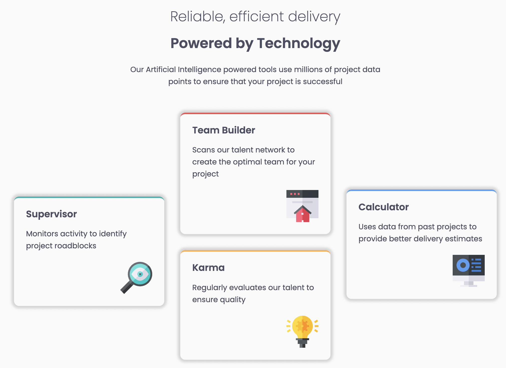

# Frontend Mentor - Four card feature section

This is a solution to the [Four card component challenge on Frontend Mentor](https://www.frontendmentor.io/challenges/four-card-feature-section-weK1eFYK). Frontend Mentor challenges help you improve your coding skills by building realistic projects.

## Table of contents

- [Overview](#overview)
  - [The challenge](#the-challenge)
  - [Screenshot](#screenshot)
  - [Links](#links)
- [My process](#my-process)
  - [Built with](#built-with)
  - [Useful resources](#useful-resources)
- [Author](#author)
- [Acknowledgments](#acknowledgments)

## Overview

### The challenge

Users should be able to:

- View the optimal layout for the site depending on their device's screen size

### Screenshot



### Links

- [Four card component](https://four-card-component.vercel.app/)

### Built with

- Semantic HTML5 markup
- CSS custom properties
- Flexbox
- Mobile-first workflow

### What I learned

Improved my understanding of flexbox

```css
.layer-1 {
	margin-top: 20px;
	border-radius: 10px;
	padding: 1.5em;
	box-shadow: 0 0 5px 5px rgb(213, 212, 212);
}
```

### Useful resources

- [Scrimba](https://scrimba.com/learn/learnreact) - This platform provided me with an opportunity to learn react for free

## Author

- Github - [@soji](https://github.com/soji-opa)

## Acknowledgments

I am very grateful to [Smug](https://github.com/theadusamuel) & [Openwell](https://github.com/openwell) for always making time out of their busy schedules to see to my coding challenges and providing me with extra motivation.
